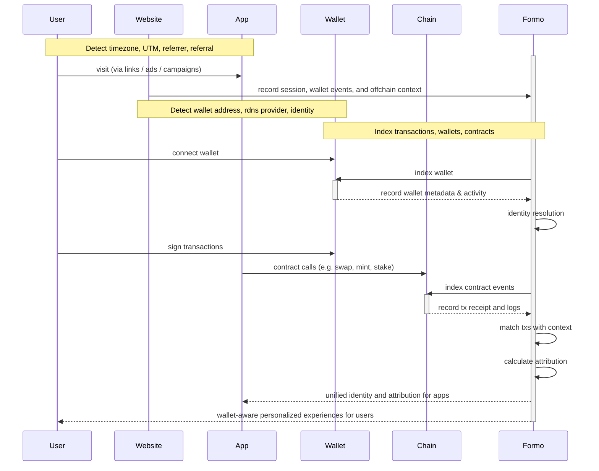

### Overview

User acquisition is one of the biggest problems in crypto. 
For an app to succeed, it must have **sustainable unit economics** when it comes to user acquisition. 
The lifetime revenue of a user (LTV) should be greater than the cost to acquire them (CAC) at a healthy multiple.

<Frame>
  
</Frame>

Without accurate attribution, you are lost in the dark forest. 
Attribution helps answer:
- Where did users come from? 
- What meaningful activity did users perform on my app?
- How well are users monetizing? How much revenue did I make? (ARPU, LTV)
- How long are users sticking around? (Retention, Churn)
- Is my ROI for an acquisition channel positive? (LTV > CAC)

### Example

Attribution in web3 is *complex*. As you've seen in the above example, not everything you care about is onchain. 

Consider the following example user journey for a DEX called FooSwap with many touchpoints:

- A user sees an tweet thread about an app on X (*"referrer"*) clicks on a referral link 
- The user visits the app's website (fooswap.com) 
- The user visits the app (app.fooswap.com)
- The user connects their wallet on the app
- The user signs a token approval message
- The user starts a swap transaction but the wallet has insufficient gas
- The user abandons their transaction (*"dropoff"*)
- The user revisits the app from another channel on Farcaster (*"referrer"*)
- The user completes a swap transaction (*"conversion"*) emitting an onchain event

In this example, two touchpoints contribute to the successful conversion: X and Farcaster. Using an [attribution model](/data/attribution#attribution-models), we can assign different weights to these touchpoints to determine their relative importance in the conversion:

- Using first touch model, the complete conversion can be attributed to X and the referral
- Using last touch model, the complete conversion can be attributed to Farcaster
- Using a linear attribution model, we could assign a weight of 0.5 to each touchpoint, meaning that both X and Farcaster contributed equally to the conversion

### How attribution works in Formo

To understand the full user journey, **we must navigate two different worlds: offchain and onchain.** 
It's imperative to trace the event sequence from initial engagement offchain to conversion onchain.

Here's a high-level overview of how it works:

Formo solves two core functions: attribution and identity.
- **Attribution** refers to [event-based analytics](/data/events/overview) about where, how, and when users interact with links, sites, and apps (touchpoint trackers, UTM & referral parameters, events, ingestion). 
- **Identity** refers to the resolution of user activity into a single [unified profile](/features/wallet-intelligence/wallet-profiles) (sessions, demographics, wallets, onchain data).

Spend less time building analytics and leave the complex data engineering to us.

### Attribution models

Formo helps you understand the impact of each touchpoints in each user journey, whether with first or last touch (single-touch attribution) or across multiple touchpoints using multi-touch attribution.

| Model       | Description                                                                                                |
| :---------- | :--------------------------------------------------------------------------------------------------------- |
| First Touch | Gives 100% credit to the first touchpoint within the attribution lookback window                           |
| Last Touch  | Gives 100% credit to the last touchpoint within the attribution lookback window                            |
| Linear      | Gives equal credit to every touchpoint leading up to a conversion within the lookback window |

> Looking for more attribution models? [Let us know](mailto:support@formo.so).

### Glossary

| Term                   | Definition                                                                                                                                                                                             |
| :--------------------- | :----------------------------------------------------------------------------------------------------------------------------------------------------------------------------------------------------- |
| User journey           | Consists of touchpoints and the conversion event. It is possible for a conversion event to have no corresponding touchpoints (eg. utm parameters). In this case we consider it a 'direct' conversion     |
| Conversion             | The primary event you're interested in analyzing with multi-touch attribution models. Typically some final value generating interaction such as "Mint" or "Swap" or "Stake".                     |
| Touchpoint             | Actions (events) a user's taken or exposed to along the journey before doing the conversion event. [Eg. does event A → B → C → D (conversion event) in a 7 day period; For a lookback window of 7 days, A, B, C are all considered touchpoints] |
| Lookback window        | The time window where a user's events with this attribution property are counted towards the calculation. The window ends when the conversion metric happens.                                            |
