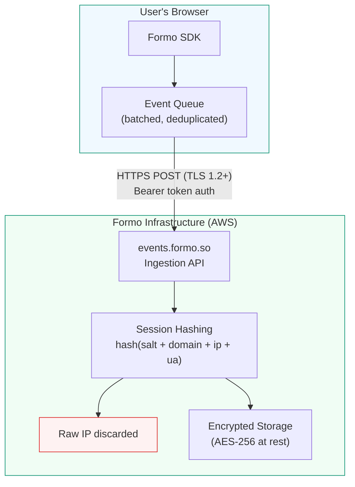

### Data Flow

This diagram shows how data flows from the user's browser through the Formo SDK to our infrastructure.



**What the SDK sends:** event type, anonymous session ID, wallet address, chain ID, user agent, browser type, timezone, language, page URL, UTM parameters, and custom event properties.

**What the SDK does NOT send:** IP addresses, cookies, local storage data, device fingerprints, or social profiles.

**What happens server-side:** The server receives the IP address via standard HTTP headers (this is true for any HTTP request to any server, including GA4 and Umami). Formo uses the IP address only to compute a daily-rotating session hash for unique visitor counting, then discards it. The raw IP address is never stored in logs or databases.

### What We Do NOT Collect

| Data type | Collected? |
| :--- | :--- |
| IP addresses | **No** - discarded after session hashing |
| Device fingerprints (Canvas, WebGL) | **No** |
| Third-party cookies | **No** |
| Email addresses | **No** |
| Phone numbers | **No** |
| Social profiles (Twitter, Discord) | **No** |
| Passwords or credentials | **No** |
| Local storage or IndexedDB contents | **No** |
| Cross-site tracking identifiers | **No** |

---

### NO IP Addresses

> We do NOT store IP addresses.

Every HTTP request to any server (including GA4, Umami, and Plausible) includes the sender's IP address as part of the protocol. Our server uses the IP address **only** to compute the daily session hash above, then discards it. The raw IP address is never written to logs, databases, or anywhere on disk.

### NO Fingerprinting

> We do NOT use device or browser fingerprinting.

We do not attempt to generate a device-persistent identifier because they are considered personal data under GDPR.

To count unique visitors, we generate a daily-changing identifier on the server using data from standard HTTP headers:

```
hash(daily_salt + website_domain + ip_address + user_agent)
```

This hash is a **one-way function** - it cannot be reversed to recover the original IP address or user-agent. The salt rotates every 24 hours, making cross-day correlation impossible.

### NO Third-party Cookies

> We do NOT read nor set any third-party cookies.

We care about the privacy of your visitors. Cookies are something that can track visitors across multiple websites and domains.

*We do not store, use, retrieve, nor extract third-party cookies from visitor's devices.*

We do use first-party cookies to support cross-subdomain tracking. This is necessary to see when visitors go from your site (formo.so) to your app (app.formo.so).

### No PII

> We do NOT collect personally identifiable information.

Wallet addresses are **pseudo-anonymous identifiers** - similar to session IDs. They are not inherently linked to a person's real-world identity.

However, we recognize that under certain privacy frameworks (including GDPR), wallet addresses that *can* be linked to an individual may be considered personal data.

**How Formo handles this:**

- The SDK collects wallet addresses as analytics identifiers, not for personal identification
- We do **not** collect social profiles (Twitter, Discord, email) through the SDK
- If the Formo dashboard displays ENS names or social handles, this data is resolved from **public data sources** (e.g. ENS registry, Farcaster) - not collected by the SDK from your users
- We do not correlate wallet addresses with off-chain personal data, through probabilistic matching or any other means.

<Info>
Public blockchain data (wallet addresses, ENS names, onchain social profiles) is already visible to anyone via block explorers like Etherscan. Formo does not create new data linkages, it surfaces data that is publicly available.
</Info>

### User Agent

> We collect and store the user agent and browser type.

The SDK sends the full user-agent string (`navigator.userAgent`) and a browser type (e.g. `chrome`, `firefox`, `safari`). Both are stored.

User agents are standard browser identifiers that websites use to understand which browsers and devices visitors are using. They are not unique enough to identify individuals on their own.

### Screen Dimensions

> We collect and store screen and viewport dimensions.

We collect device screen and browser viewport dimensions to understand how visitors view your site:

- `screen_width` - Width of the device screen in pixels
- `screen_height` - Height of the device screen in pixels
- `screen_density` - Pixel density of the device screen (devicePixelRatio)
- `viewport_width` - Width of the browser viewport in pixels
- `viewport_height` - Height of the browser viewport in pixels

### Timezone

> We collect and store the timezone of each visitor.

### Country

> We collect and store country of each visitor.

We collect visitor country based on the their time zone, not their IP address.

Every country has their own time zone and modern devices automatically update the time zone when the device travels.
The time zone is limited to a country, so we can't get data about a city or region within a country.

### Language

> We collect and store language of each visitor.

Devices are set to a certain language. We collect the language of the device being used by a visitor.

### URL

> We collect and store URLs.

We collect the URL to track page visits and referrers.

### Referrer

> We collect and store referrers.

Referrers answer the question "Where did this visitor come from?". Browsers send the URL of the previous website as a referrer.
We also check UTM-parameters. You can see a list of your site's referrers in your dashboard.

### UTM

> We collect and store UTM parameters.

UTM parameters such as `utm_source`, `utm_medium`, and `utm_campaign`, are a way to track the source of a visitor.
They are added to a URL to track where a visitor came from.

We track these UTM codes:

- `utm_source` (e.g.: google.com)
- `utm_medium` (e.g.: search)
- `utm_campaign` (e.g.: summer_sale)
- `utm_content` (e.g.: summer_sale)
- `utm_term` (e.g.: summer_sale)

### Referral

> We collect and store referral parameters.

Referral parameters such as `referral` and `ref` are a way to track who referred a visitor.
They are added to a URL to track where a visitor came from.

We track these UTM codes and assign it to each user:

- `referral` (e.g.: google.com)
- `ref` (e.g.: search)
- `refcode`

### Wallet Provider

> We collect and store the crypto wallet type of visitors.

We collect the wallet type (EIP6963's `rdns` identifier) to identify the wallet type of the visitor.

### Wallet Address

> We collect and store wallet addresses.

We collect the wallet address to identify a visitor.

### Chain Id

> We collect and store chain ids.

We collect the chain id to identify the connected chain of the visitor.

### Wallet Connected

> We collect and store wallet connected status.

We collect the wallet connected status to identify if a visitor has connected their wallet.

### Wallet Metadata

> We collect and store signature and transaction metadata.

We collect signature and transaction metadata such as statuses (success, failed, pending, etc.) and transaction hashes.

### Form Data

> Form data is determined by you, the Customer.

If you use [Token Gated Forms](/features/token-gated-forms/form-builder), any data submitted by end users through your forms is collected and stored. The content of this data is determined entirely by the form fields you create.

You are responsible for ensuring that sensitive data is not collected through forms without appropriate legal basis and explicit consent.

## FAQ

<AccordionGroup>
  <Accordion title="Are wallet addresses considered personal data under GDPR?">
    The classification of wallet addresses under GDPR depends on context. Formo treats wallet addresses as pseudonymous identifiers — they are not linked to names, emails, or IP addresses in our system. We recommend consulting your legal counsel for guidance specific to your jurisdiction and use case.
  </Accordion>
  <Accordion title="How does Formo determine a visitor's country without storing IP addresses?">
    Formo derives the visitor's country from the browser's timezone (`Intl.DateTimeFormat().resolvedOptions().timeZone`) on the client side. This maps a timezone to a country code without using IP geolocation. The raw IP address is never stored.
  </Accordion>
  <Accordion title="Does Formo set any cookies?">
    Formo uses first-party cookies for anonymous visitor identification and cross-subdomain tracking (e.g., an `anonymous-id` cookie and session cookies). These are first-party cookies scoped to your domain only — Formo does **not** set any third-party cookies or cross-site tracking cookies. Because Formo does not use third-party cookies, most jurisdictions do not require a cookie consent banner, but consult your legal counsel for your specific case.
  </Accordion>
</AccordionGroup>
